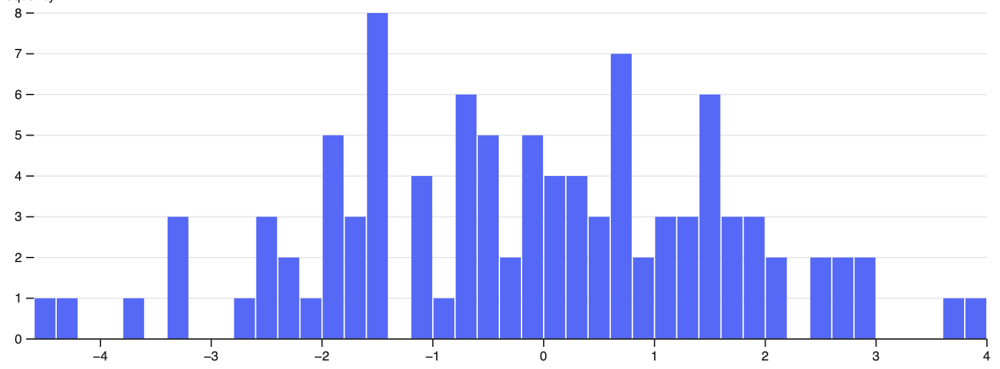

# NV5 - 3rd party JS charts

NV5 is a JS SDK that enables chart integration in a web page/app as a 3rd party javascript.
It allows to quickly add visualizations using only a custom data endpoint.

NV5 is a pet project started with the intent to simplify chart integrations on various webapps without needing to delve into complex JS libraries.
Also eliminates page loading times due to its asynchronous nature.


## How to integrate

The SDK is at ```./js/sdk/``` starting at ```widget-sdk.js```. The rest of JS and CSS files needed are loaded from there.

It is planned to deploy this library on AWS, so it can be referenced without the need of running it independently.

In the meantime, it can be ran locally using a static http server using **npm http-server**. More on that at [npmjs http-server](https://www.npmjs.com/package/http-server).
Project on [HTML5 Boilerplate](https://github.com/h5bp/html5-boilerplate).

### Basic method

In HTML, create an element and give it an unique ID (```nv5-chart``` in this case)
```HTML
<div id="nv5-chart" style="width: 800px; height: 300px;"></div>
```

at the bottom of the HTML, add the library

```HTML
<script src="http://<...>/js/sdk/widget-sdk.js"></script>
```

next, for each element (i.e. chart) call the ```NV5.Add(<type>, <id>, <options>)``` method wrapped in a function assigned to ```window.NV5_ready```.
Options in the ```Add``` method expect an ```url``` to a JSON endpoint and a ```method``` to fetch the data.

```HTML
<script>
  window.NV5_ready = function() {

    NV5.Add('histogram', 'nv5-chart', {
      url: window.NV5SDKURL + "/api/numbers_array.json",
      method: 'GET'
    });

    NV5.Add(...);

  }
</script>
```
Add as many charts as needed inside ```NV5_ready```.

Sample chart:


### Extra parametrization

```javascript
 NV5.Add('line', 'line-sales-sire', {
    url: window.NV5SDKURL + "/api/.../${user}/...",
    method: 'GET',
    headers: {}, // pass headers to the request
    parameters: { // parameters to pass in url
        'user': 1
    },
    parametersToUpdate: [['user'],] //  allows updating defined parameters values, filters are changed, to feed the chart with new date
}, {
    info: true, // chart tooltip
    auxTable: true, // auxiliary table
    table: { // auxiliary table details
        transpose: true,
        hideColumns: [1]
    },
    actions: [ // actions passed to chart like, custom CSS
        {
            fn: genericFn(),
        }
    ]
});
```

## Charts available

Currently, this project is the process of migrating the visualizations to [D3js](https://d3js.org). As of now online the following graphs are available:

* Histogram
* Line

## Next steps

### Page level filters - JS

To create dynamic dashboards, the SDK should implement the [Publish/Subscribe pattern](https://en.wikipedia.org/wiki/Publish–subscribe_pattern). This way, page level filters can be applied to the graphs that subscribed to them.

### Data visualization table

Enable graph values to be accessed via Table and exported to CSV.

### Next charts

* Gauge
* Horizontal Gauge
* Horizontal bars
* Pie
* Table

### JSON test data

As more graphs are added, test data will also be included in **api** folder.
This can be accessed using the internal ```window.NV5SDKURL``` value.

## MIT License

Copyright (c) 2022 Henrique G

Permission is hereby granted, free of charge, to any person obtaining a copy
of this software and associated documentation files (the "Software"), to deal
in the Software without restriction, including without limitation the rights
to use, copy, modify, merge, publish, distribute, sublicense, and/or sell
copies of the Software, and to permit persons to whom the Software is
furnished to do so, subject to the following conditions:

The above copyright notice and this permission notice shall be included in all
copies or substantial portions of the Software.

THE SOFTWARE IS PROVIDED "AS IS", WITHOUT WARRANTY OF ANY KIND, EXPRESS OR
IMPLIED, INCLUDING BUT NOT LIMITED TO THE WARRANTIES OF MERCHANTABILITY,
FITNESS FOR A PARTICULAR PURPOSE AND NONINFRINGEMENT. IN NO EVENT SHALL THE
AUTHORS OR COPYRIGHT HOLDERS BE LIABLE FOR ANY CLAIM, DAMAGES OR OTHER
LIABILITY, WHETHER IN AN ACTION OF CONTRACT, TORT OR OTHERWISE, ARISING FROM,
OUT OF OR IN CONNECTION WITH THE SOFTWARE OR THE USE OR OTHER DEALINGS IN THE
SOFTWARE.


